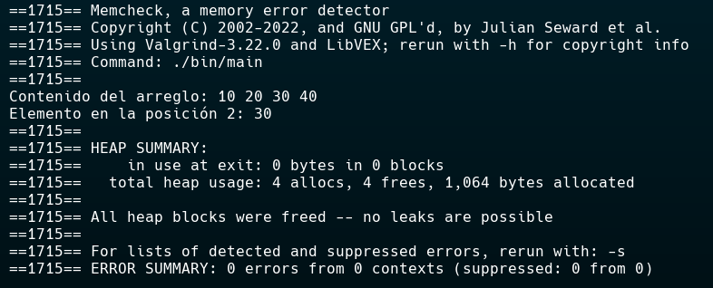

# Estructura de datos: Laboratorio #5
By: Jeremy Gomez C (JGomezC145) -- C23264


[](https://en.wikipedia.org/wiki/C99)


## Arreglos Dinámicos en C

Este repositorio contiene una implementación básica de **arreglos dinámicos**, en C desarrollada como parte del Laboratorio #5 del curso IE-0117 - Programación Bajo Plataformas Abiertas.


### Estructura del Proyecto

```
.
├── include/                # Archivos de encabezado (.h)
│   └── dynamicarray.h
├── src/                    # Implementación en C (.c)
│   ├── dynamicarray.c
│   └── main.c
├── bin/                    # Ejecutables generados por el Makefile
│   └── main
├── Makefile                # Compilación automática
└── README.md               # Este archivo
```
> [!NOTE]
> La carpeta `bin/` se genera automáticamente al compilar el proyecto y contiene el ejecutable. Sin embargo, este es ignorado por Git, por lo que puede que no esté presente en el repositorio.


### Compilación

Para compilar el proyecto, ejecuta en la raíz del repositorio:

```bash
make
```

Esto generará el ejecutable en el directorio `bin/`.


### Ejecución

Para ejecutar el programa:

```bash
./bin/main
```

(Si se utiliza Windows, use `.\bin\main.exe` si compila con MinGW.)


### Verificación de memoria

Puedes verificar que no haya *memory leaks* usando `valgrind` (en Linux o WSL):

```bash
valgrind --leak-check=full ./bin/main
```

El resultado debería mostrar que no hay fugas de memoria:




### Funcionalidad Implementada

* Crear un arreglo dinámico
* Agregar elementos al arreglo
* Obtener un elemento por índice
* Imprimir todos los elementos
* Liberar memoria usada

### Features Futuras
* Implementar funciones para eliminar elementos
* Redimensionar el arreglo dinámicamente utilizando input del usuario
* Agregar items utilizando input del usuario


